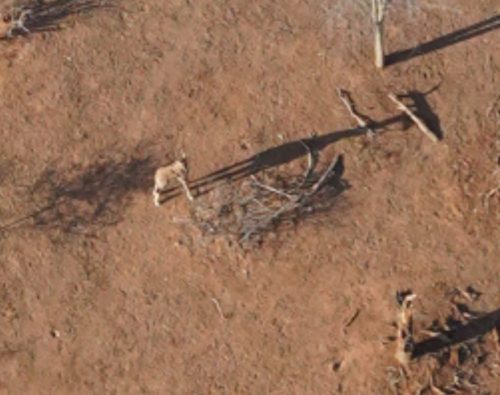
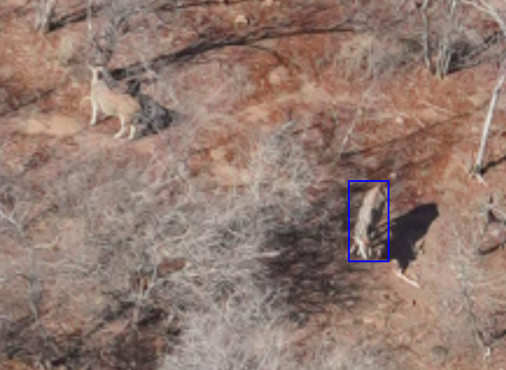

# Guide to annotating images in DetWeb

## Introduction

Sango is a 60 000 ha property located within the Save Valley Conservancy (SVC) in the south-east lowveld of Zimbabwe. Since 1998 Sango has used a Cessna 206 to conduct a total wildlife count following the traditional Rear Seat Observer (RSO) method. However, photocounts are proving to be a safer, more cost effective, and possibly more accurate method of counting animals. Sango thus aims to replace its traditional RSO count with a photo count.    

In September 2024 Sango conducted a photo count alongside their RSO count. The objective of this document is to provide training for the manual annotation of wildlife and reviewing automated detections of wildlife within these images. Roughly ~16 000 images were captured during the survey. 

## Notes

- Please report any issues or post photos of unidentifiable animals and unkown objects on the [detweb-dev chat on slack](https://tzcrc.slack.com/archives/C07S1JYFG1K) 
- Contact Brandon at brandon.giddey@gmail.com if required

---

# Getting started

## Create account 

Follow the link below to create an account on the DetWeb test site. 

[Create account on DetWeb](http://prod.d2akirfrcp5tqu.amplifyapp.com/)

Full in your details. For 'Username' Please use your Name and Surname seperated by an underscore e.g., Name_Surname. Click create account.

Copy the verification code emailed to the address you used to create the acccount.

You should now see the page below. If not follow the 'Create account on DetWeb' link above and sign in.

Contact your lab manager or other point of contact requesting permssion to start annoting images! You can also use the detweb-dev chat on slack to request permission to start annotating images.

## Where to annotate?

Each image is divided into jobs. The jobs will be demarcated by a blue annotation box. Annotations should be made in the blue box only. If you see an animal outside of the blue box you can annotate it but do not spend time and effort looking outside the blue box as these areas will come up again in another job. 

## How to annotate?

### Video tutorial for manual image annotation 

<video width="320" height="240" controls>
  <source src="Videos\DetWeb_Manual_Image_Annotation.mp4" type="video/mp4">
  Your browser does not support the video tag.
</video>

### Video tutorial for manually revieiwing automated annotations

<video width="320" height="240" controls>
  <source src="Videos\Manual_check_of_scoutbot_annotations.mkv" type="video/mkv">
  Your browser does not support the video tag.
</video>

LEFT CLICK on the center of the animals body. Do not left click next to or on top of the animal. Alternatively, it is recommened that you use the short cut keys as it is much faster. Simply hover your mouse over the animal and press the shortcut key. 

An icon will appear. 

To choose a different species RIGHT CLICK on the icon. A list of options will appear. LEFT CLICK on your chosen option. The colour of the icon should change to the colour which has been associated to that annotation. If you hover your curser over the icon a text box will appear confiriming your choice. 

To delete an annotation LEFT CLICK and the delete option should appear at the top of the list.

Once you have annotated everything within the blue box you can skip to the next image using the right arrow key. You can use the left arrow key to go back to the previous image if you need to.

## What to annotate

Below is a list of annotation choices

 

and a list of shortcut keys.

#### Notes

Annotate as unkown when you think it may be an animal but not sure.

Annotate as unidentifiable animal when you can identify that it is an animal but you are unsure of the species. 

Annotate as point of interest for anything man made e.g., vehicle, building, person, pipeline, ect.

---

# Training images

### Tips and tricks

If you are struggling to identify a species due to image quality look at the animals shadow. The horns are often clearly visible in the shadow and can be used to help identify the species.

Look at colours, you will start to recognise colour palletes for each species. Even when image quality is low you may be able identify the animal based on the colour of the pixels

Dont forget to look under trees! The oblique nature of the images allows you to view animals under trees. These areas are often over looked because of the shadow caste by the tree.

Scan from left to right - opposite to reading. It helps to keep focus and prevents 'zoning out'. Although this is just a suggestion, find what works for you. 

If you have any of your own tips or techniques please share them on the detweb-dev chat on slack!
  

# Impala
Impala can be really difficult to identify. A few tricks are to look at size and colour. Impala are a rich redish orange or coppery tan with a white underside which is sometimes visiable in images and males have cureved horns.  They can easily be confused with eland which are a warm tan or light brown with undertones of grey, however, eland are much larger and have straight horns. Impala are usually in herds and seldom on their own, if you find one be sure to look out for more. Remember to look at shadows, male impalas have distintive horns that make a unique shadow while females can be distiguishable by the shadow their ears make.

 
 

 
 

 
 

 
 

 
 

 
 
 
 

# Giraffe 

 
 

 
 

 
 
 
 

# Buffalo

 
 

 
 
 
 

# Elephant

 
 

 
 

 
 

 
 
 
 

# Kudu
The Kudu is generally light brown or grayish-brown. They have large ears which can often be seen in images, sometimes creating a distintive shadow.

 
 

 
 
 
 

# Jackal 
Both the black backed and side striped jackal occur on Sango, however, the former is more common. 

 
 
 
 

# Baobab

 
 

 
 

 
 

 
 
 
 

# Blue wildebeest
The blue wildebeest is a grayish-blue or slate-gray color. Its body is often marked with darker vertical stripes, giving it a brindled appearance. They have muscular body with a distinctive, sloped back that gives it a unique profile.  

 
 
 
 

This wildebeest is really difficult to identify, however, he was a part of a larger herd captured in the image. So based on the colouration alone it can be confirmed this is wildebeest. 

 
 
 
 

# Lion

 
 
 
 

# Eland
The eland are a tan or light brown colour, often with a slight reddish tint. They also have characteristic series of thin white stripes running vertically along their sides. Eland have a muscular body, supported by long, slender legs. They have a slight hump over the shoulders and a short thick neck. Both male and female have straight, spiraling horns. 

 
 

 
 

 
 
 
 

# Unidentifiable animal

If you are not able to identify which species of animal it is use unidentifiable animal. Sometimes the quality of the image is not good enough or the animal is partially obstructed a tree. 

 
 

 
 

 
 

 
 
 
 

# Zebra
Zebra are known for their destinctive black and white stripes. They have a compact, sturdy body with a barrel-shaped torso. 

 
 

 
 
 
 

# Waterpoint

 
 

 
 
 
 

# Rhino

